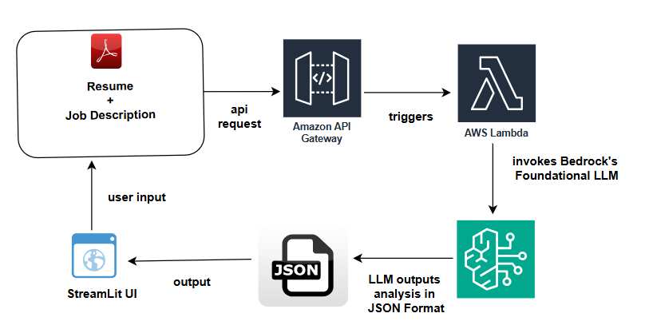

# 🚀 AI Resume Analyzer

## Overview
This project is an **AWS-powered AI Resume Analyzer** designed to help job seekers assess their resume match for a given job description. It utilizes **Amazon Bedrock’s Foundation Model (LLM)** to analyze skills, experience, and job fit.

## 🔹 Features
- 📂 **Upload Resume (PDF)** and **Enter Job Description** via a **Streamlit UI**
- ⚡ **Amazon API Gateway & AWS Lambda** handle requests
- 🤖 **Amazon Bedrock LLM** analyzes:
  - **Skills & Experience Match Percentage**
  - **Key Skills Gaps**
  - **A Short Summary on Why You’d Be an Ideal Candidate**
- 📊 **Results displayed in real-time on the UI**

## 🏗️ Architecture


## 🛠️ Setup Instructions
### Prerequisites
- Python 3.12
- Streamlit
- AWS Account (for API Gateway, Lambda, and Bedrock access)
- `requests` library for API calls

### Installation
```bash
# Clone the repository
git clone https://github.com/yourusername/ai-resume-analyzer.git

# create a lambda function with code in app.py
# Request for model access via Amazon Beedrock
# Create an API using Amazon API Gateway (HTTP API) and integrate the lambda function to trigger it upon request
# Add a layer by uploading the resume_analyzer_lambda_layer.zip in Lambda for installing dependencies.
```

### Running the Application
```bash
streamlit run app.py
```

## 🌟 Future Enhancements
- 📈 Improve accuracy with fine-tuned AI models
- 🔍 Add **interactive visualizations** for analysis
- 🔄 Support **multiple file formats (DOCX, TXT, etc.)**

## 📬 Feedback & Contributions
Feel free to **open issues** or **submit pull requests** to improve this project. Let's make AI-driven job search smarter!

---

**Built with ❤️ using AWS & AI**  
#AI #AWS #JobSearch #MachineLearning #ResumeAnalyzer
